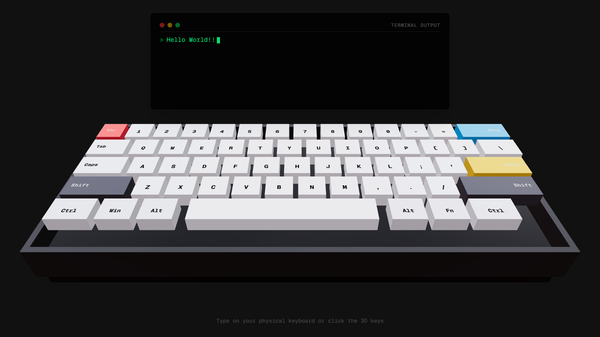

# 3D Keyboard Chat – Dreamlike Machine Terminal

A 3D‑style browser chat interface built from the v0.app **3‑D Keyboard
Chat** template.

## 📦 Project Overview

The UI simulates a stylized 3D keyboard area paired with a chat interface, ideal for experiments, aesthetic chat apps, surreal UI concepts, or creative web prototypes. 3D Keyboard Chat – Dreamlike Machine Terminal places the user in front of a floating, three-dimensional keyboard and a retro terminal-style chat window. Keys are rendered as 3D objects in space. The focus is on making the interface feel alive, surreal, and emotionally present, in line with the DreamWare Hackathon’s “engineering the surreal” theme.

------------------------------------------------------------------------

## 🌐 Live Demo

[Demo Website](https://web-keyboard-3d-y7k1.vercel.app/)

------------------------------------------------------------------------

## 📸 Screenshot



------------------------------------------------------------------------

## ✨ Features

-   3D‑inspired keyboard UI\
-   Clean chat layout\
-   Responsive and modern design\
-   Ideal base for surreal or creative web experiences\
-   Works with React/Next.js structure internally

------------------------------------------------------------------------

## 🚀 Getting Started

### 1. Clone the Repository

``` bash
git clone https://github.com/yourusername/web-keyboard-chat-3d
cd web-keyboard-chat-3d
```

### 2. Install Dependencies

``` bash
npm install
```

### 3. Run the Development Server

``` bash
npm run dev
```

------------------------------------------------------------------------

## Roadmap / Future Work

- Richer AI persona and prompt design  
- Spatial audio (key clicks, ambient hums, machine whispers)  
- In‑world UI elements like floating status lights or visualized “thoughts”  
- Accessibility features (keyboard-only navigation, high contrast mode)

------------------------------------------------------------------------

## Customization Ideas

To push the experience further into “dreamlike” territory:

- Mood-based lighting that responds to sentiment in recent messages  
- Idle behaviors (machine “muttering” or UI shifts when user stops typing)  
- Glitch effects for specific keywords or emotional peaks  
- Multiple “machine personas” or moods that unlock over time
